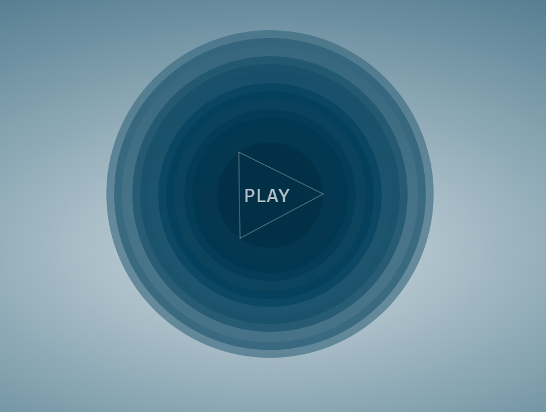
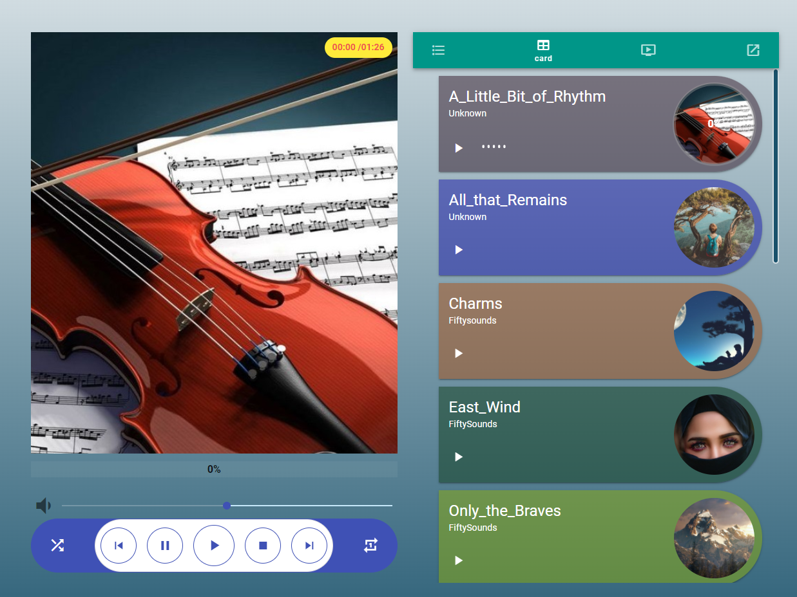
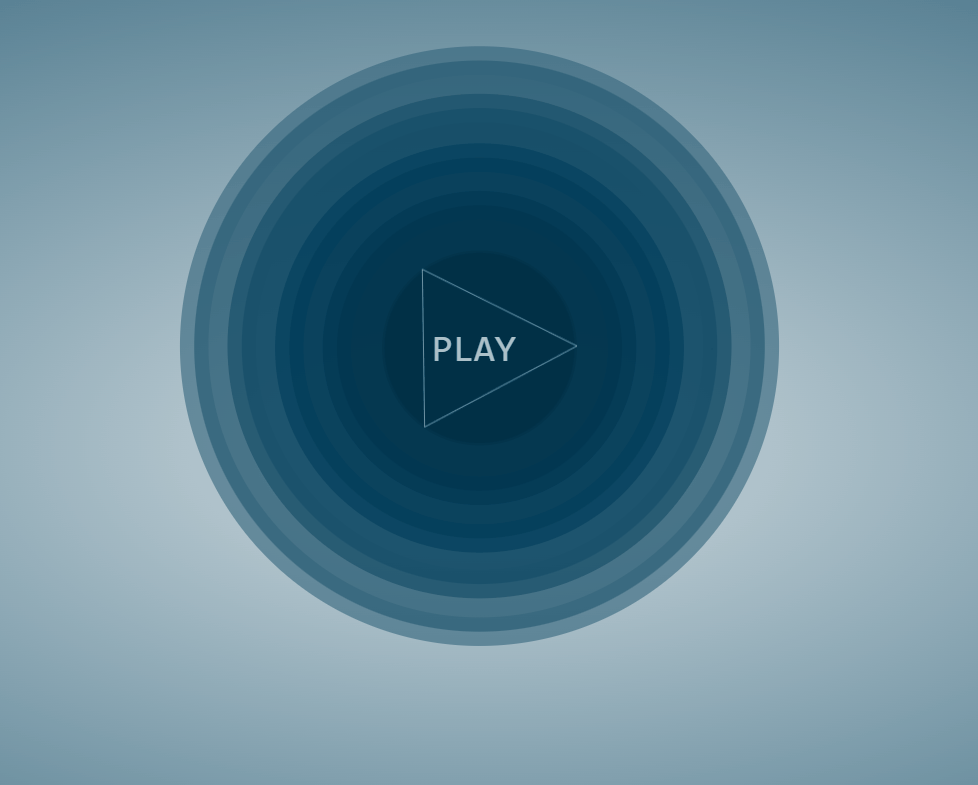
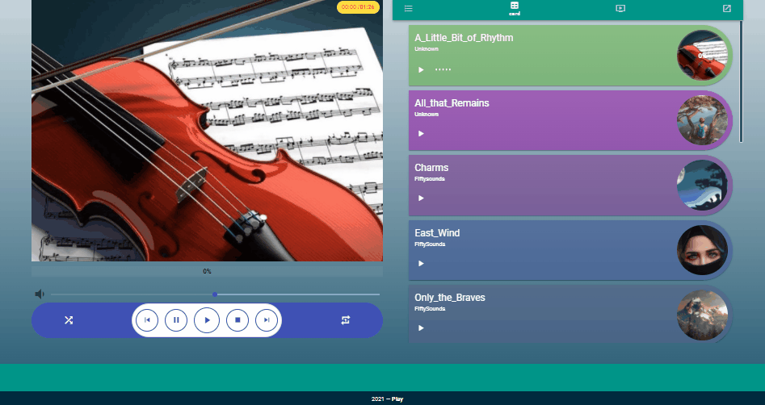
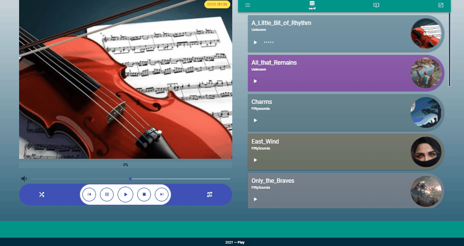
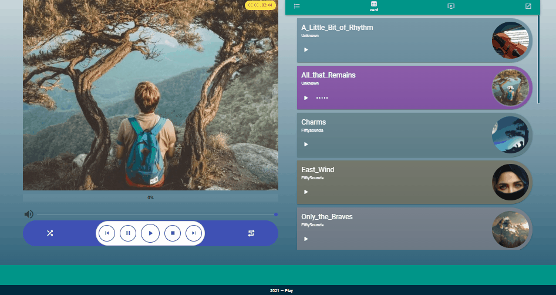

# player-vue-4

Music playback project based on the Howlerjs and VueJs library..

vista presentacion/home


vista del Reproductor/player


# Link Prewiew
[Play-Music](https://verastian.github.io/player-music/)
## Project setup
```
npm install
```

### Compiles and hot-reloads for development
```
npm run serve
```

### Compiles and minifies for production
```
npm run build
```

### Lints and fixes files
```
npm run lint
```

### Customize configuration
See [Configuration Reference](https://cli.vuejs.org/config/).

## Built with 🛠️


* [Vue CLI](https://cli.vuejs.org/) - Command line interface Vue 
* [VueJS](https://vuejs.org/v2/guide/)- Framework Vuejs v2
* [Vue Router](https://router.vuejs.org/)- 0fficial router for Vue.js 
* [Vuex](https://vuex.vuejs.org/)- State management pattern 
* [Vuetify](https://vuetifyjs.com/en/) - Vue UI Library
* [howler.js](https://github.com/goldfire/howler.js/) - Audio library
* [Axios](https://axios-http.com/docs/intro) - HTTP Client for node.js

### Some catches

Homepage:


Playlists:


Control play:


Different ways of control:
